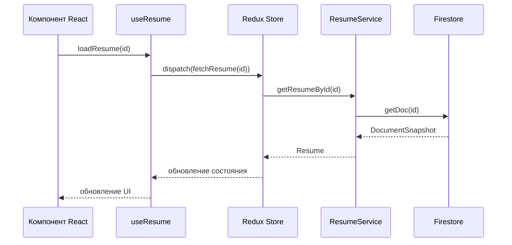
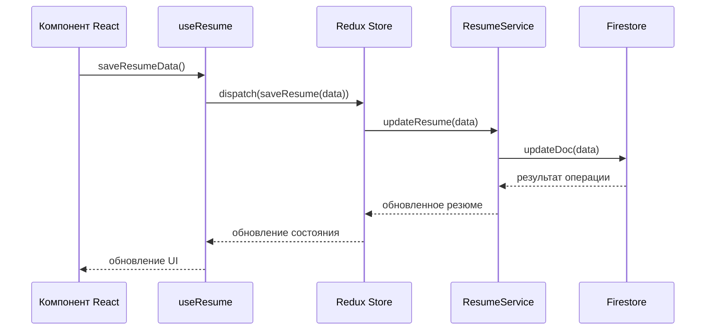

# Архитектура проекта Resume Builder

## Обзор

Resume Builder - это веб-приложение для создания и управления резюме. Приложение построено на основе React с использованием TypeScript и следует современным архитектурным подходам.

## Архитектурные принципы

Проект следует следующим архитектурным принципам:

1. **Разделение ответственности** - каждый компонент, хук или сервис имеет четко определенную ответственность
2. **Модульность** - код организован в модули, которые можно легко заменить или расширить
3. **Абстракция** - сложные операции скрыты за простыми интерфейсами
4. **Тестируемость** - код написан таким образом, чтобы его можно было легко тестировать

## Структура проекта

```
src/
├── assets/            # Статические ресурсы (изображения, иконки)
├── components/        # Общие компоненты UI
│   ├── shared/        # Общие компоненты, используемые на разных страницах
│   └── ui/            # Базовые UI компоненты (кнопки, поля ввода и т.д.)
├── features/          # Функциональные модули
│   ├── home/          # Функционал домашней страницы
│   │   └── components/# Компоненты домашней страницы
│   └── resume/        # Функционал работы с резюме
│       ├── components/# Компоненты для работы с резюме
│       │   ├── form/  # Компоненты форм
│       │   └── preview/# Компоненты предпросмотра
│       ├── hooks/     # Хуки для работы с резюме
│       └── slice/     # Redux слайсы для резюме
├── hooks/             # Устаревшие хуки (будут перенесены в features)
├── layouts/           # Шаблоны страниц
├── lib/               # Вспомогательные функции и утилиты
├── services/          # Сервисы для работы с внешними API
│   └── firebase/      # Сервисы для работы с Firebase
├── store/             # Конфигурация Redux
└── types/             # TypeScript типы и интерфейсы
```

## Слои приложения

Приложение разделено на следующие слои:

1. **Слой представления (Presentation Layer)**
   - Компоненты React в `features/*/components`
   - Отвечает за отображение данных и взаимодействие с пользователем

2. **Слой приложения (Application Layer)**
   - Хуки в `features/*/hooks`
   - Redux слайсы в `features/*/slice`
   - Координирует действия между UI и бизнес-логикой

3. **Сервисный слой (Service Layer)**
   - Сервисы в `services/*`
   - Реализует бизнес-логику и взаимодействие с внешними API

4. **Слой доступа к данным (Data Access Layer)**
   - Реализован в сервисах Firebase
   - Отвечает за работу с хранилищем данных

5. **Доменный слой (Domain Layer)**
   - Типы и интерфейсы в `types/`
   - Определяет бизнес-модели и правила

## Потоки данных

### Поток данных при загрузке резюме



### Поток данных при сохранении резюме



## Ключевые компоненты

### Компоненты страниц

- **Home** - домашняя страница
- **Dashboard** - страница со списком резюме пользователя
- **EditResume** - страница редактирования резюме

### Компоненты форм

- **ResumeForm** - основная форма редактирования резюме
- **PersonalDetailForm** - форма личных данных
- **ExperienceForm** - форма опыта работы

### Компоненты предпросмотра

- **ResumePreview** - предпросмотр резюме
- **PersonalDetailPreview** - предпросмотр личных данных
- **ExperiencePreview** - предпросмотр опыта работы

## Управление состоянием

Для управления состоянием используется Redux Toolkit:

- **resumeSlice** - слайс для работы с данными резюме
- **useResume** - хук для работы с резюме через Redux

## Взаимодействие с Firebase

Взаимодействие с Firebase абстрагировано через сервисы:

- **AuthService** - сервис для аутентификации
- **ResumeService** - сервис для работы с резюме

## Оптимизация производительности

В проекте используются следующие техники оптимизации:

1. **Мемоизация компонентов** - все компоненты обернуты в `React.memo`
2. **Ленивая загрузка** - компоненты загружаются по мере необходимости с помощью `React.lazy`
3. **Кэширование данных** - данные кэшируются в Redux store

## Тестирование

Проект включает следующие типы тестов:

1. **Модульные тесты** - тесты для отдельных функций и компонентов
2. **Интеграционные тесты** - тесты для взаимодействия между компонентами

## Дальнейшее развитие

Планы по дальнейшему развитию архитектуры:

1. **Полный переход на структуру features** - перенос всех компонентов в соответствующие feature-модули
2. **Внедрение React Query** - для более эффективного управления асинхронными запросами и кэширования
3. **Улучшение типизации** - более строгая типизация для повышения надежности кода
4. **Расширение тестового покрытия** - добавление e2e тестов
